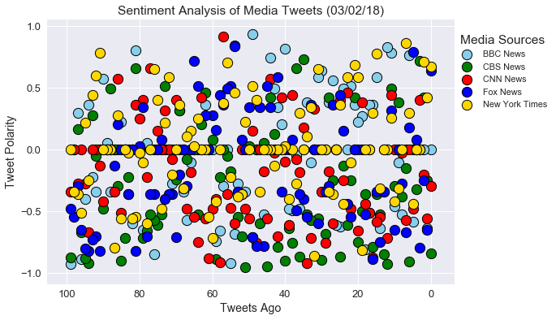
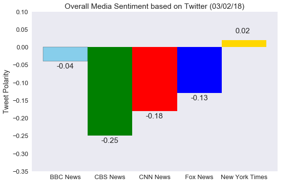

# News Mood

* Observed trend 1  
  Based on the most recent 100 tweets from the five news media, the overall sentiments of the tweets are relatively neutral.  The sentiment compound score has a wide spread from positive to negative but centralized around 0.
  
  
  <br>

* Observed trend 2  
  Among the five news media, the sentiment of CBS News is relatively more negative than others, and New York Times are more neutral than others.
  
  
  <br>
  

* Observed trend 3  
  The pattern or trend of the sentiment is not changing with time from the first tweet till the 100th tweet.  Seems the mood of media is stable as of report date.
  
  
  <br>
  
  [Link to codes and results]()

```python
# import dependencies
import tweepy
import pandas as pd
import matplotlib.pyplot as plt
import seaborn as sns
from vaderSentiment.vaderSentiment import SentimentIntensityAnalyzer
import config
import numpy as np
import time
```


```python
# get tweepy credentials from config.py and pass them to get authentication
auth = tweepy.OAuthHandler(config.consumer_key, config.consumer_secret)
auth.set_access_token(config.access_token, config.access_token_secret)
api = tweepy.API(auth)
# initialize Vader analyzer
analyzer = SentimentIntensityAnalyzer()
```


```python
# create news media list
news_media = ['@BBCNews','@CBSNews','@CNN','@FoxNews','@nytimes']
# create a dataframe to save results
result_df = pd.DataFrame(columns = ['news_media','Tweet','Tweet_Date','Sentiment_Compound',
                                 'Sentiment_Positive','Sentiment_Neutral','Sentiment_Negative'])
# define number of tweets to retrieve for analysis
num_tweets = 100
# capture report date to use on charts
report_date = time.strftime("%x")
```


```python
# loop through all news media to retrieve tweets and analyze sentiments
for media in news_media:
    # use extended mode to search for the full text of each tweet
    for tweet in tweepy.Cursor(api.user_timeline,id=media,tweet_mode='extended').items(num_tweets):
        # use try except to determine if the tweet is a retweet
        try:
            # if it is a retweet and retweeted_status exists, retrieve the full text which is in retweeted_status dict
            text = tweet.retweeted_status.full_text
        # if it is an original tweet, retrieve the full text in the full_text field
        except AttributeError:
            text = tweet.full_text
        # analyze the sentiment scores and save them to the result dataframe
        sentiment_comp = analyzer.polarity_scores(text)['compound']
        sentiment_pos = analyzer.polarity_scores(text)['pos']
        sentiment_neu = analyzer.polarity_scores(text)['neu']
        sentiment_neg = analyzer.polarity_scores(text)['neg']
        result_df = result_df.append({'News_Media':media,
                                      'Tweet':text,
                                        'Tweet_Date':tweet.created_at,
                                        'Sentiment_Compound':sentiment_comp,
                                        'Sentiment_Positive':sentiment_pos,
                                        'Sentiment_Neutral':sentiment_neu,
                                        'Sentiment_Negative':sentiment_neg},
                                        ignore_index=True)
# save results to csv file
result_df.to_csv('tweet_sentiment_scores_by_news_media.csv',index=False)
```


```python
# define the x axis and y axis to plot for each news media
y_axis_BBC = result_df.loc[result_df['News_Media'] == '@BBCNews']['Sentiment_Compound']
y_axis_CBS = result_df.loc[result_df['News_Media'] == '@CBSNews']['Sentiment_Compound']
y_axis_CNN = result_df.loc[result_df['News_Media'] == '@CNN']['Sentiment_Compound']
y_axis_FOX = result_df.loc[result_df['News_Media'] == '@FoxNews']['Sentiment_Compound']
y_axis_NYT = result_df.loc[result_df['News_Media'] == '@nytimes']['Sentiment_Compound']
x_axis = np.arange(num_tweets)
```


```python
# use Seanborn style and set font scale
sns.set(font_scale=1.3)
# create a sub plot
fig, ax = plt.subplots(figsize = (9,6))
# define the size of circles
size = 150
# plot scatter for each news media
ax.scatter(x_axis,y_axis_BBC,marker='o',color='skyblue',linewidths=1,edgecolors='k',s=size)
ax.scatter(x_axis,y_axis_CBS,marker='o',color='g',linewidths=1,edgecolors='k',s=size)
ax.scatter(x_axis,y_axis_CNN,marker='o',color='r',linewidths=1,edgecolors='k',s=size)
ax.scatter(x_axis,y_axis_FOX,marker='o',color='b',linewidths=1,edgecolors='k',s=size)
ax.scatter(x_axis,y_axis_NYT,marker='o',color='Gold',linewidths=1,edgecolors='k',s=size)
# Invert the x axis to show numbers from 100 to 0
ax.invert_xaxis()
# set the ticks on y axis
ax.yaxis.set_ticks(np.arange(-1,1.5,.5))
# set the plot title and labels for x and y axis
ax.set_xlabel('Tweets Ago')
ax.set_ylabel('Tweet Polarity')
ax.set_title('Sentiment Analysis of Media Tweets (%s)'% report_date)
# set the legend for the plot
plt.legend(['BBC News','CBS News','CNN News','Fox News','New York Times'],loc=(1,.65),title='Media Sources',fontsize='x-small')
# save png image
plt.savefig('Sentiment_analysis_by_media.png')
# show plot
plt.show()
```





```python
# calculate the average of sentiment scores by news media and round to 2 decimals
average = result_df.groupby('News_Media').mean().round(2)
# get the average sentiment compound score
average_compound = average['Sentiment_Compound']
# get the count of medias for x axis
num_media = len(average)
# get the min and max of average compound score and use them to set ticks on y axis
average_min = min(average_compound)
average_max = max(average_compound)
# define colors for the bars
colors = ['skyblue','g','r','b','Gold']

```


```python
# use Seanborn style and select dark without grid and set font scale
sns.set(style='dark',font_scale=1.3)
# create a sub plot
fig, ax = plt.subplots(figsize = (9,6))
# plot a bar chart
ax.bar(np.arange(num_media),average_compound,color = colors,edgecolor='k',width=1,
       tick_label=['BBC News','CBS News','CNN News','Fox News','New York Times'])
# add average score values to the chart
for index, value in enumerate(average_compound):
    # if score greater than 0, add score on top of bar
    if value >= 0:
        ax.text(index - .2,value + .02,value)
    # if score less than 0, add score below bar
    else:
        ax.text(index - .2,value - .02,value)
# set the plot title and label for y axis
ax.set_ylabel('Tweet Polarity')
ax.set_title('Overall Media Sentiment based on Twitter (%s)'% report_date)
# set the ticks on y axis
ax.yaxis.set_ticks(np.arange(average_min - .1,average_max + .1,.05))   
# save png image
plt.savefig('Overall_media_sentiment.png')
# show plot
plt.show()
```




